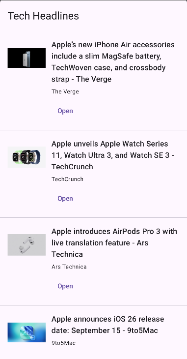

# CopilotCodingChallenge

# News (Compose + Hilt + MVVM + Retrofit + Coil)

Single-screen app that fetches **Top Tech Headlines** from **NewsAPI** and displays them in a native Compose list. Shows a loading indicator, handles errors with retry, and loads images via Coil.

## Tech
- Kotlin, Jetpack Compose (Material 3)
- Hilt (DI)
- MVVM + Clean (domain/use-case/repository)
- Retrofit + Gson + OkHttp
- Coil

## Setup
1. Obtener API Key en https://newsapi.org/
2. Crear `local.properties` en el root (junto a gradle.properties) con:
3. Ejecutar el proyecto en Android Studio.

## Notas
- Endpoint usado: `/v2/top-headlines?category=technology&country=us&pageSize=20`
- La API key se inyecta en `BuildConfig.NEWS_API_KEY`.

## 📸 Screenshots
